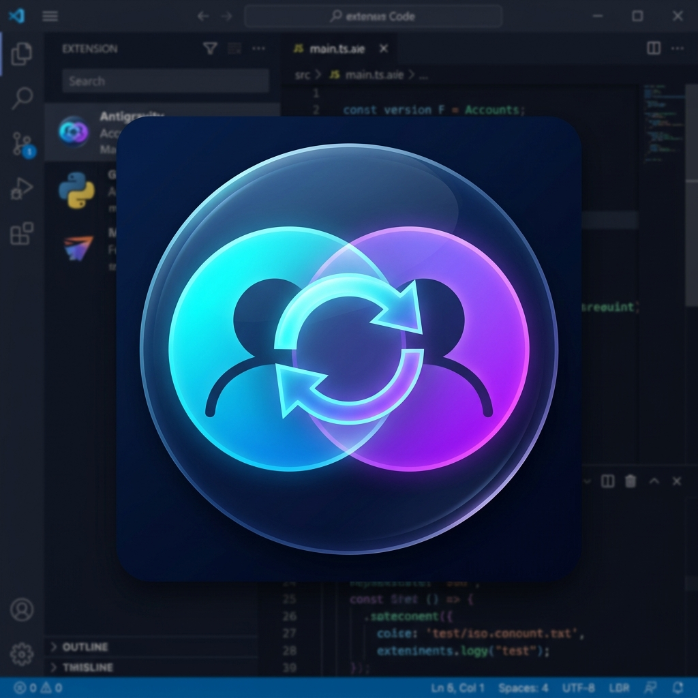

<div align="center">
  
  <h1>Antigravity Account Switcher</h1>
  <p><b>Switch between multiple Google accounts in Antigravity IDE with one click.</b></p>

  <p>
    
    
    
  </p>
</div>

---

> Switch between multiple Google accounts in [Antigravity IDE](https://antigravity.google) with one click — no manual logout/login needed.

## 🚀 The Problem

Antigravity IDE only supports **one active Google account** at a time. When your quota runs out, the manual sign-out/sign-in process is slow and repetitive. This extension makes it a **single click**.

## ⚙️ How it works

Your auth tokens are saved locally for each account. When you switch, the extension swaps the tokens and restarts the IDE — you're instantly logged in as the new account.

```
~/.antigravity-switcher/
  config.json          ← Account registry
  accounts/
    111111/            ← Gmail #1 tokens
    222222/            ← Gmail #2 tokens
```

*Privacy: All data stays on your local machine. No external tracking or servers.*

## 📦 Installation

### Option A — From GitHub Releases (Recommended)

1.  Go to the **[Releases](../../releases)** page.
2.  Download the latest `.vsix` file (e.g., `antigravity-switcher-2.1.0.vsix`).
3.  In Antigravity/VS Code:
    *   Open **Extensions** (`Ctrl+Shift+X`).
    *   Click the **`...`** (Views and More Actions) in the top right.
    *   Select **Install from VSIX...**
    *   Choose the downloaded file.

### Option B — Build from Source

```bash
git clone https://github.com/zecoryx/antigravity-switcher
cd antigravity-switcher
npm install
npx vsce package --no-dependencies
```

## 🛠 Usage

### 1. Add Accounts
- Sign in to Antigravity with **Gmail #1**.
- Open Command Palette (`Ctrl+Shift+P`) → search for **"Antigravity: Add Account"**.
- Enter your email and a nickname.
- **Sign out** and repeat for **Gmail #2**.

### 2. Switch
Click the **`👤 Account Name`** in the status bar (bottom left) or use the **Accounts Panel** in the sidebar.

## 🤖 Automated Release (For Developers)

This project is automated with GitHub Actions. To push a new release:
1. Update version in `package.json`.
2. Push a new tag:
   ```bash
   git tag v2.2.0
   git push origin v2.2.0
   ```
The CI/CD will automatically build the VSIX and create a GitHub Release.

## 📄 License

MIT Licensed. Open source and free to use.
